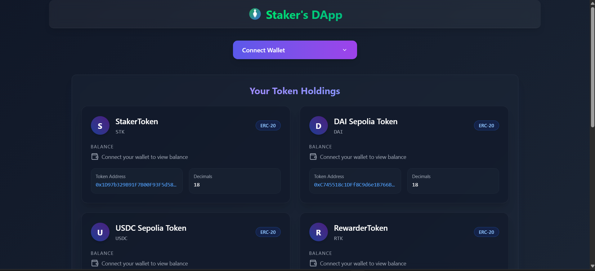
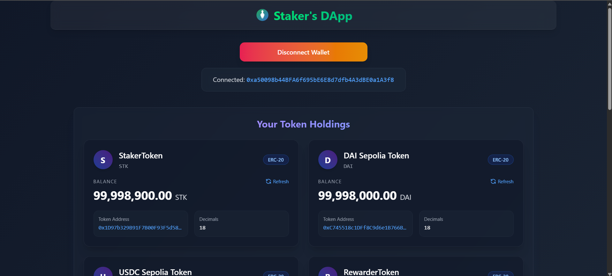
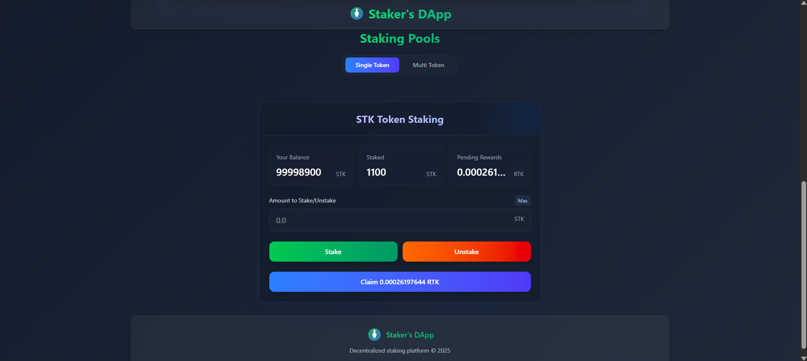
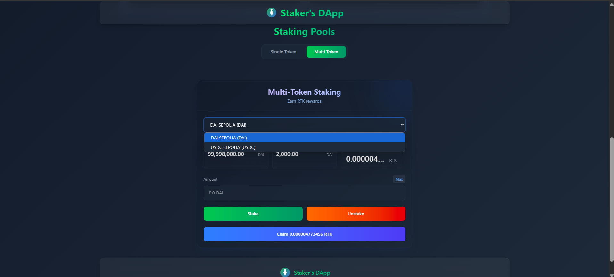

## Project Overview 
- A comprehensive staking platform where users can stake STK tokens to earn RTK rewards, plus multi-token pools supporting USDC and DAI with whitelisting capabilities. 

- Each tokens you stake will earn you a reward token RTK. You can check you wallet balances of the tokens on the Homepage once you connect your wallet.

- As of now it is deployed on Sepolia so the USDC and DAI token is also a mock token contract which is deployed by me for this project on Sepolia.

- The layout is fully responsive and can be used on any preferred devices like mobile, tablet or desktops.

#### Built using React+Vite TailwindCSS Wagmi WalletConnect Solidity Foundry 

[Click here to view the live project](https://staking-dapp-beryl.vercel.app/)
## Project ScreenShots
#### 1. View Once you visit as a User for the first time.

#### 2. After connecting your required wallet.

#### 3. Stake Staker Token which is a platform token STK and get RTK

#### 4. Stake USDC or DAI and get RTK in rewards

